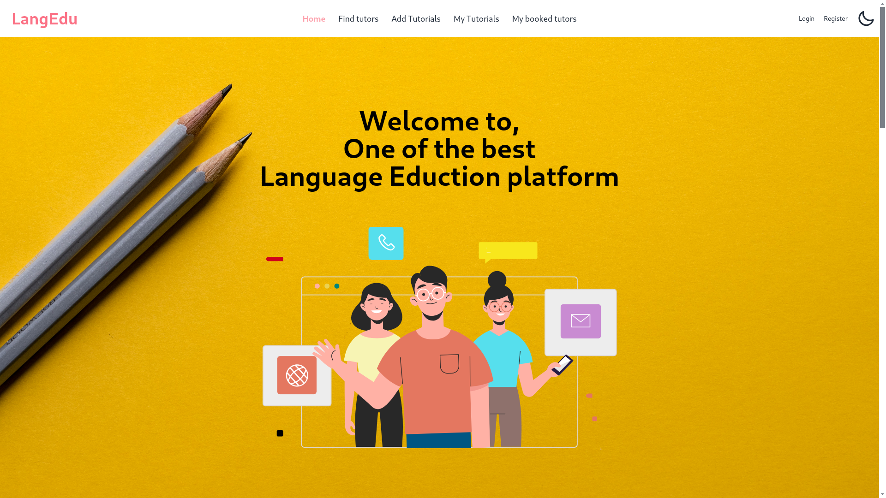

# 🌐 LangEdu

 <!-- Replace with an actual screenshot -->

## 📌 Project Overview

**LangEdu** is a **language education platform** inspired by Preply and italki, where users can find online tutors to learn or teach any language. The platform offers an easy-to-use interface and ensures responsive design across devices.

🔗 **Live Project:** [LangEdu](https://langedu-6f081.web.app)

---

## 🚀 Technologies Used

### **Frontend**
- ⚡ [Vite](https://vitejs.dev/)
- ⚛️ [React](https://react.dev/)
- 🎨 [Tailwind CSS](https://tailwindcss.com/)
- ✨ [DaisyUI](https://daisyui.com/)
- 🔀 [React Router Dom](https://reactrouter.com/en/main)
- 🔄 [Axios](https://axios-http.com/)
- ⚙️ [TanStack React Query](https://tanstack.com/query/latest)

### **Backend**
- 🌍 [Node.js](https://nodejs.org/)
- 🚀 [Express.js](https://expressjs.com/)
- 🛢️ [MongoDB](https://www.mongodb.com/)
- 🔐 [Firebase Authentication](https://firebase.google.com/)
- 🔑 [JSON Web Token (JWT)](https://jwt.io/)

---

## ✨ Key Features

✅ **Fully Responsive** – Works smoothly on mobile, tablet, and desktop.  
✅ **User Authentication** – Email/password login & Google authentication via Firebase.  
✅ **CRUD Operations** – Users can **add**, **update**, **get**, and **delete** language learning content.  
✅ **Secure API** – JWT-based authentication to protect user data.  
✅ **Efficient Data Fetching** – Uses TanStack React Query for optimized API calls.  
✅ **Error Handling** – Built-in mechanisms to manage common errors smoothly.  
✅ **Theme Controller** – Users can switch between different themes for personalized experience.  

---

## 📦 Dependencies

```json
{
  "@tanstack/react-query": "^5.62.8",
  "axios": "^1.7.9",
  "firebase": "^11.1.0",
  "lottie-react": "^2.4.0",
  "react": "^18.3.1",
  "react-dom": "^18.3.1",
  "react-icons": "^5.4.0",
  "react-player": "^2.16.0",
  "react-router-dom": "^7.1.0",
  "react-toastify": "^11.0.2",
  "sweetalert2": "^11.15.3",
  "swiper": "^11.1.15"
}
```

---

## 🛠️ Installation & Setup

Follow these steps to run the project locally:

### **1️⃣ Clone the Repository**
```sh
git clone https://github.com/yourusername/langedu.git
cd langedu
```

### **2️⃣ Install Dependencies**
```sh
npm install
```

### **3️⃣ Set Up Environment Variables**
Create a `.env` file in the root directory and add your Firebase API key.

```env
VITE_FIREBASE_API_KEY=your_firebase_api_key
```

### **4️⃣ Run the Development Server**
```sh
npm run dev
```
Now, open **http://localhost:5173** in your browser.

---

## 🌐 Live Project & Resources

- **🔗 Live Website:** [LangEdu](https://langedu-6f081.web.app)
- **📚 React Query Docs:** [TanStack Query](https://tanstack.com/query)
- **🔐 Firebase Authentication:** [Firebase Auth](https://firebase.google.com/docs/auth)

---

## 🤝 Contributors

- **Your Name** – [GitHub Profile](https://github.com/yourusername)
- Contributions welcome! Feel free to fork and submit pull requests.

---

## 📜 License

This project is licensed under the **MIT License**.

---

🚀 **Enjoy using LangEdu!** 🌍🎓